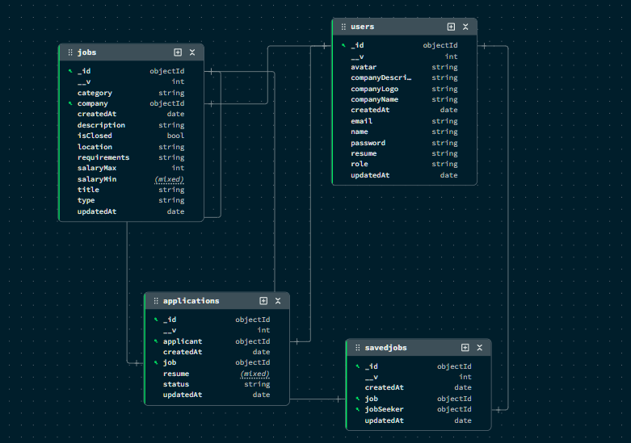

# JobLauneSathi

JobLauneSathi is a full-stack MERN application designed to connect job seekers with employers. It provides a comprehensive platform for posting job listings, managing applications, and discovering career opportunities.

## Features

### For Job Seekers
- **Job Discovery**: Search and filter jobs by keyword, location, category, job type, and salary range.
- **Profile Management**: Create and update your user profile, including your name and avatar.
- **Resume Upload**: Upload and manage your resume (PDF format) for easy application.
- **Job Applications**: Apply for jobs directly through the platform.
- **Saved Jobs**: Bookmark jobs to review and apply for later.
- **Application Tracking**: View the status of your submitted applications (e.g., Applied, In Review, Accepted).

### For Employers
- **Job Management**: Create, edit, and delete job postings with detailed descriptions and requirements.
- **Applicant Tracking**: View and manage all applications for a specific job. Update applicant statuses to streamline the hiring process.
- **Company Profile**: Manage your public-facing company profile, including a description and logo.
- **Analytics Dashboard**: Get an overview of hiring metrics, including total active jobs, applications received, and successful hires, with trend analysis.

## Tech Stack

- **Frontend**:
  - React
  - Vite
  - Tailwind CSS
  - Framer Motion
  - Axios
  - React Router
  - Lucide React (for icons)
  - React Hot Toast (for notifications)

- **Backend**:
  - Node.js
  - Express.js
  - MongoDB
  - Mongoose
  - JSON Web Tokens (JWT) for authentication
  - Bcrypt for password hashing
  - Multer for file uploads
  - CORS

## Project Structure

The repository is organized as a monorepo with the following structure:

- `frontend/`: Contains the React client-side application.
- `backend/`: Contains the Node.js and Express.js server-side API.
- `bruno/`: Includes a Bruno collection for easy API testing and documentation.

## Database ER diagram


## Getting Started

### Prerequisites
- Node.js (v20.19.0 or later)
- pnpm package manager
- MongoDB instance (local or remote)

### Backend Setup

1.  Navigate to the `backend` directory:
    ```sh
    cd backend
    ```

2.  Install dependencies:
    ```sh
    pnpm install
    ```

3.  Create a `.env` file from the example:
    ```sh
    cp .env.example .env
    ```

4.  Populate the `.env` file with your credentials. To work seamlessly with the frontend, set `PORT` to `8000`.
    ```env
    PORT=8000
    MONGO_URI=your_mongodb_connection_string
    JWT_SECRET=your_jwt_secret_key
    ```

5.  Run the development server:
    ```sh
    pnpm run dev
    ```
    The backend will be running on `http://localhost:8000`.

### Frontend Setup

1.  Navigate to the `frontend` directory:
    ```sh
    cd frontend
    ```

2.  Install dependencies:
    ```sh
    pnpm install
    ```

3.  Ensure the backend is running, as the frontend is configured to make API requests to `http://localhost:8000`.

4.  Run the development server:
    ```sh
    pnpm run dev
    ```
    The application will be accessible at `http://localhost:5173` (or another port if 5173 is in use).

## API

The backend API provides endpoints for authentication, user profiles, job management, applications, and analytics.

The API endpoints are organized as follows:
- `/api/auth`: User registration, login, and profile updates.
- `/api/jobs`: CRUD operations for jobs, searching, and filtering.
- `/api/applications`: Job application submission and status management.
- `/api/save-jobs`: Saving and unsaving jobs.
- `/api/user`: Public user profiles.
- `/api/analytics`: Analytics for the employer dashboard.

A complete Bruno collection is available in the `bruno/` directory for testing all API endpoints. You can open the `bruno/Job Posting API` folder in Bruno to get started.
Also, there is openapi.json file in the burno folder which you can import.